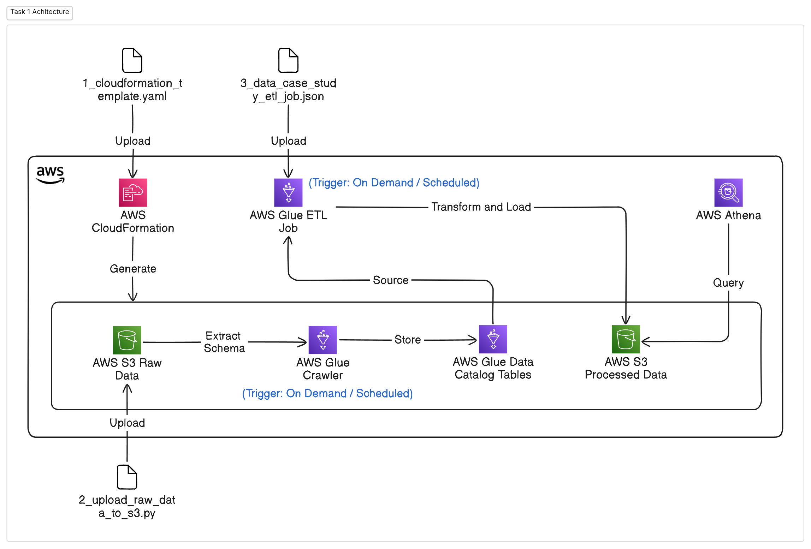
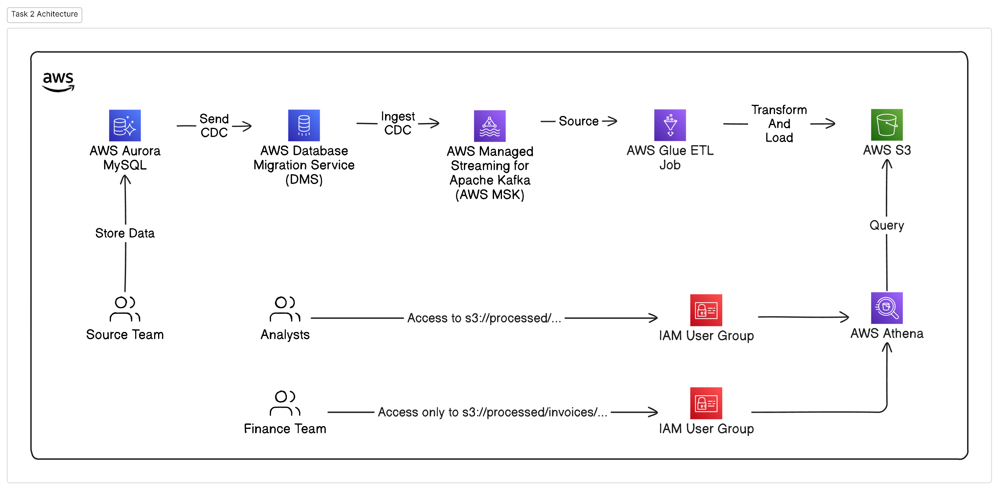

# Project: Data Case Study

## Table of Contents

1. [Project Overview](#project-overview)
2. [Project Structure](#project-structure)
3. [Task 1: Building an ETL pipeline](#task-1-building-an-etl-pipeline)
    - 3.1 [Demo Video](#demo-video)
    - 3.2 [Architecture Diagram](#architecture-diagram)
    - 3.3 [Intermediate Data Models](#intermediate-data-models)
    - 3.4 [Design Choices and Considerations](#design-choices-and-considerations)
4. [Task 2: System Design](#task-2-system-design)
    - 4.1 [Architecture Diagram](#architecture-diagram-1)
    - 4.2 [Architecture Decisions and Rationale](#architecture-decisions-and-rationale)
5. [Future consideration: Machine Learning Integration](#future-consideration-machine-learning-integration)
    - 5.1 [Data Processing for ML](#data-processing-for-ml)
    - 5.2 [SageMaker Overview](#sagemaker-overview)

## Project Overview

This project involves creating the ETL pipeline using **AWS**. The objective of this assignment is to leverage AWS's
cloud-native capabilities to build scalable, automated solutions for data ingestion, transformation, and storage,
supporting various user groups like analysts and finance teams.

**Task 1:** focuses on building an ETL pipeline using AWS Glue, AWS S3, and other relevant AWS services to process raw
data into structured formats. The pipeline ensures efficient data processing with features like date-based partitioning
for querying at different points in time and job bookmarking for optimized performance and cost control.

**Task 2:** designs a production-level system architecture capable of supporting continuous data ingestion and
transformation using AWS DMS, MSK, and AWS Glue, with data stored in S3 and queried using Athena. This system
accommodates future CDC (Change Data Capture) capabilities and aligns with best practices for data storage and
access control, enabling various teams to access the data they need securely and efficiently.

## Project Structure

```text
data-case-study/
│
├── data/                                   # Raw data files
│   └── raw/                                # Contains original CSV files
│       ├── accounts.csv
│       ├── invoice_line_items.csv
│       ├── invoices.csv
│       └── skus.csv
│
├── deliveries/                             # Project deliverables and completed tasks
│   ├── task_1/                             # Task 1 files
│   │   └── diagrams/                       # Architecture diagrams for Task 2
│   │   │   └── task_1_architecture.png     # Architecture diagrams for Task 1
│   │   ├── 1_cloudformation_template.yaml  # CloudFormation template for resources
│   │   ├── 2_upload_raw_data_to_s3.py      # Script to upload CSV files to S3
│   │   └── 3_data_case_study_etl_job.json  # Configuration for AWS Glue ETL job
│   └── task_2/                             # Task 2 files
│       └── diagrams/                       # Architecture diagrams for Task 2
│           └── task_2_architecture.png
│
└── docs/                                   # Instructions
    └── tasks/
        ├── README-task-one.md
        └── README-tasktwo.txt
```

## Task 1: Building an ETL pipeline

### Demo Video

For a detailed
walkthrough, [Please Watch This Demo Video](https://drive.google.com/file/d/18wLhQmXfjdaJ5ZA34HUASNA4nI13Z7eR/view?usp=sharing)

### Architecture Diagram



### Intermediate Data Models

- **Raw Data Model**: The initial dataset is stored in its raw form in the **data-case-study-raw-data** S3 bucket. This
  includes CSV files for **accounts**, **invoice line items**, **invoices**, and **skus** tables, as provided in the
  input dataset.

- **Processed Data Model**: After ETL transformations, the resulting features are stored in the
  **data-case-study-processed-data** S3 bucket. Two distinct levels of datasets are created in this process:
    - **Account-Level Aggregations**: Features aggregated by account ID to provide a summary of each account's
      activities.
    - **Account-Invoice-Level Aggregations**: Detailed features at the invoice level to capture data on individual
      invoice payments and related behaviors.

**Reasoning for Model Choice**: The separation into account-level and account-invoice-level models provides flexibility
for analysis. Account-level data supports high-level trend analysis across accounts, while invoice-level data allows for
a deeper exploration of individual transaction patterns, enhancing predictive modeling for invoice payment behaviors.

### Design Choices and Considerations

- **Feature Extraction**: Based on the requirement, the extracted features should predict how likely customers are to
  pay invoices on time. These features are split
  into account-level and account-invoice-level details:

    - **Account-Level Features**:
        - **feature_account_age_day** and **feature_account_age_year**: These features capture the duration a customer
          has been with the company, indicating account longevity. Longer relationships might suggest loyalty, while new
          accounts might show different payment behaviors.
        - **feature_customer_age_over_one_year**: This binary feature marks customers who have been active for over a
          year, distinguishing newer accounts from more established ones. Established accounts may exhibit different
          payment reliability.
        - **feature_total_invoices**: Total invoices associated with an account reflect transaction frequency and
          engagement level. High invoice frequency may correlate with consistent payment behavior.
        - **feature_avg_invoice_interval_day**: Average days between invoices indicate payment frequency. Shorter
          intervals may suggest regular payment habits, which could be predictive of timely payments.

    - **Account-Invoice-Level Feature**:
        - **feature_invoice_spending**: This feature calculates the total amount spent per invoice. Higher spending
          amounts might correlate with varying payment tendencies, such as delayed payments for larger invoices.

- **Choice of AWS Services**: To meet the requirement of using a big data framework, AWS Glue was chosen as it is built
  on Apache Spark, enabling scalable, distributed data processing. Key reasons for using AWS Glue and other AWS services
  include:

    - **AWS Glue ETL**: AWS Glue ETL jobs leverage **Spark** under the hood, offering the flexibility of distributed
      data processing with control over CPU and memory resources. Glue also supports **Job Bookmarks**, which track
      previously processed data to prevent reprocessing, optimizing for both performance and cost.

    - **AWS S3**: Used for storing raw and processed data, S3 provides a cost-effective and scalable storage solution.

    - **AWS Glue Crawler**: Automatically detects schema changes in raw data and catalogs them, simplifying data
      discovery and metadata management. This ensures the ETL pipeline remains adaptable to evolving data structures.

    - **AWS Glue Data Catalog**: Serves as a centralized metadata repository, making data assets accessible for querying
      by Athena and other services. This centralization enables seamless integration across the data pipeline.

    - **AWS Athena**: Allows querying of processed data directly from S3 using SQL, supporting ad hoc and analytical
      queries on the transformed dataset without the need for a dedicated database, thus lowering infrastructure costs.

- **Scaling**: As data volume grows, Glue’s Spark-based architecture can scale horizontally by increasing the number of
  Data Processing Units (DPUs).

- **Scheduling**: AWS Glue ETL jobs and Crawlers can be set to run on a scheduled basis (e.g. daily, hourly).

- **Partitioned Data Storage**: The current ETL job design stores processed data based on the job's run date as
  partitions in S3, structured by `ingest_year`, `ingest_month`, and `ingest_day`. This structure facilitates efficient
  querying and data
  organization. By enabling the **Job Bookmark** feature in AWS Glue, the job ensures that only new, unprocessed data is
  handled during each run, preventing duplication and optimizing resource use.

- **Error Handling and Monitoring**: AWS Glue provides built-in job monitoring and logging via CloudWatch, enabling
  tracking of job performance, debugging, and alerts for any failures.

- **Security and Compliance**: By using AWS IAM roles and policies, access to S3 and Glue resources is tightly
  controlled. Encryption options are also available to secure data at rest in S3 and in transit during Glue job
  execution.

- **Cost Optimization**: Glue auto-scaling capabilities help to optimize resource usage and cost by automatically
  adjusting the required DPUs based on workload, preventing over-provisioning and minimizing costs.

- **Data Consistency and Schema Evolution**: Glue Crawlers dynamically detect changes in data schema and update the Data
  Catalog.

- **Automation and Workflow Management**: To enhance the automation of the ETL pipeline, AWS Step Functions can be used
  to create an orchestrated workflow. This approach starts with new data being uploaded to an S3 bucket, triggering an **EventBridge** 
  rule. The rule initiates an AWS Step Functions state machine, which can include the following steps:
    - **Data Validation**: A Lambda function can be included to validate the data for compliance with required
      standards. If validation fails, the state machine returns an error, preventing further processing.
    - **ETL Job Execution**: Upon passing validation, the state machine triggers the AWS Glue Crawler to update the Data
      Catalog, followed by running the AWS Glue ETL job to process and store the data in S3.

## Task 2: System Design

### Architecture Diagram



### Architecture Decisions and Rationale

**Source System (AWS Aurora MySQL)**:

- The source team stores operational data in AWS Aurora MySQL.

**AWS Database Migration Service (DMS)**:

- AWS DMS is a managed service for data migration and replication between database systems. It supports Change Data
  Capture (CDC), enabling the continuous synchronization of data changes from the source to the target system. DMS
  streams CDC events from Aurora MySQL to AWS Managed Streaming for Apache Kafka (MSK), allowing near real-time
  processing and ensuring data freshness.

**AWS Managed Streaming for Apache Kafka (MSK)**:

- MSK integrates with Apache Kafka and can be set as the target for DMS, serving as the data source for AWS Glue ETL
  jobs.

**AWS Glue ETL Job**:

- AWS Glue's Spark-based ETL capabilities enable distributed, scalable data processing. ETL jobs can be scheduled or
  triggered as needed, with **Job Bookmarks** ensuring only new or changed data is processed, preventing duplication and
  enhancing efficiency.

**AWS S3**:

- Processed data is stored in S3 using a partitioned structure (e.g.,
  `ingest_year=2024/ingest_month=11/ingest_day=03/`), facilitating time-based analysis. This method, demonstrated in
  Task 1, allows for easy retrieval of historical data and meets the requirement of viewing data snapshots over time (
  e.g., comparing data from one month ago with current data).

- To manage storage costs and enable data retention, S3 lifecycle policies can be applied. These policies move older
  data to cost-effective storage tiers (e.g., S3 Glacier) after a defined period. By maintaining structured
  partitions and using these lifecycle rules, the system meets both the analyst's requirement for accessing
  historical data and the need to optimize storage usage.

- **Finance Team Data Access**: With S3's partitioned storage and Athena's SQL-based querying capabilities, data
  access can be managed effectively through IAM user groups. By assigning the finance team to a specific IAM user
  group, permissions can be configured to restrict their access to only the relevant invoice data path (e.g.,
  `s3://data-case-study-processed-data/invoices/`). This ensures secure, role-based access control, allowing the
  finance team to query the data they need while maintaining strict data governance.

**AWS Athena**:

- Analysts and the finance team leverage Athena for querying processed data stored in S3. With its integration with the
  Glue Data Catalog, Athena supports SQL-based queries without needing additional database infrastructure, making it an
  efficient solution for data analysis.

**Trigger Mechanism**:

- An **EventBridge** rule can be used to trigger ETL jobs when new data is detected in MSK. This automation ensures
  timely processing and data availability for downstream consumption.

## Future consideration: Machine Learning Integration

### Data Processing for ML

Once the data has been processed through the ETL pipeline and stored in S3, it can be prepared for machine learning
tasks. Preprocessed and structured data provides a foundation for building predictive models and advanced data
analytics. This allows us to leverage ML to predict whether users will pay their invoices on time.

### SageMaker Overview

**Amazon SageMaker** is a fully managed service that allows developers and data scientists to build, train, and deploy
machine learning models at scale. SageMaker streamlines the end-to-end machine learning workflow by integrating data
processing, model training, and deployment within a single platform. It supports popular machine learning frameworks
such as TensorFlow, PyTorch, and XGBoost, providing flexibility for various use cases.

Once processed data is stored in Amazon S3, it can be seamlessly used for training models in SageMaker. This data acts
as the input for training algorithms that can learn patterns and make predictions.